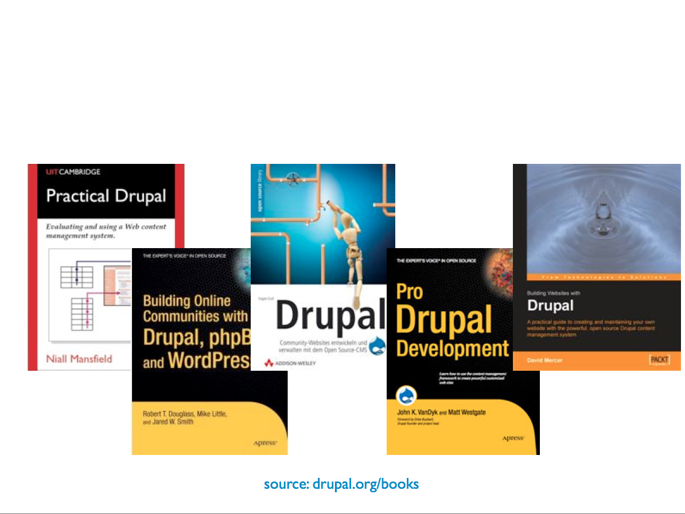
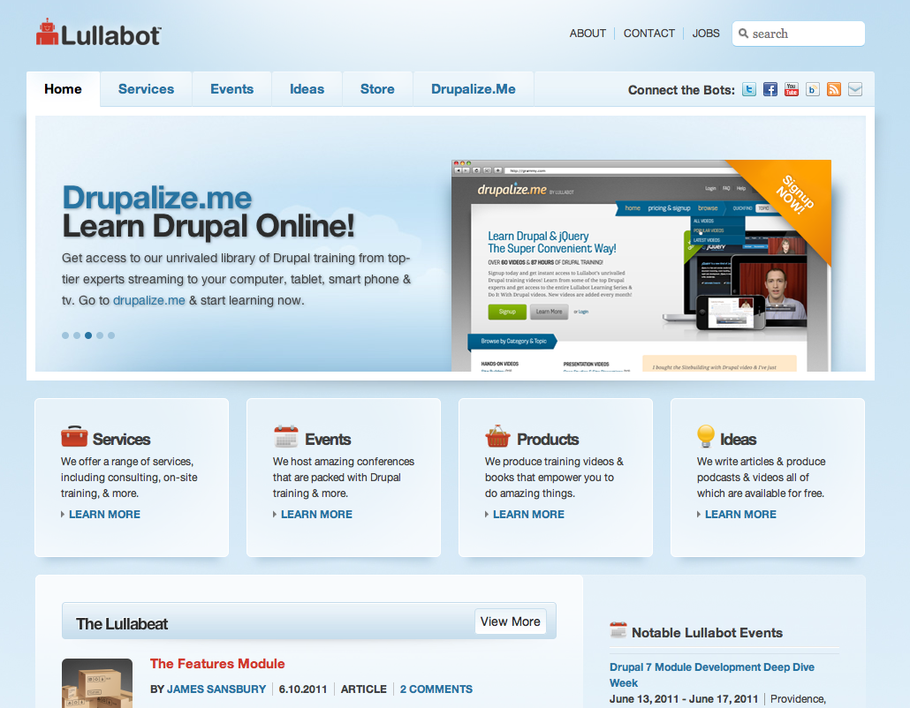
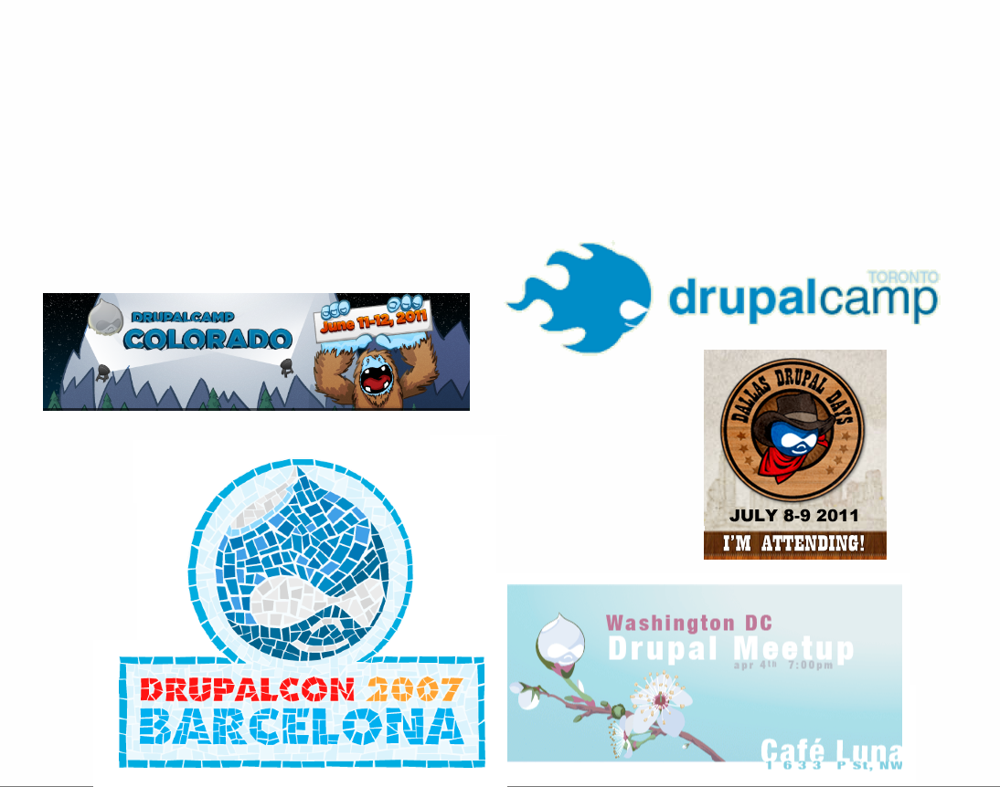
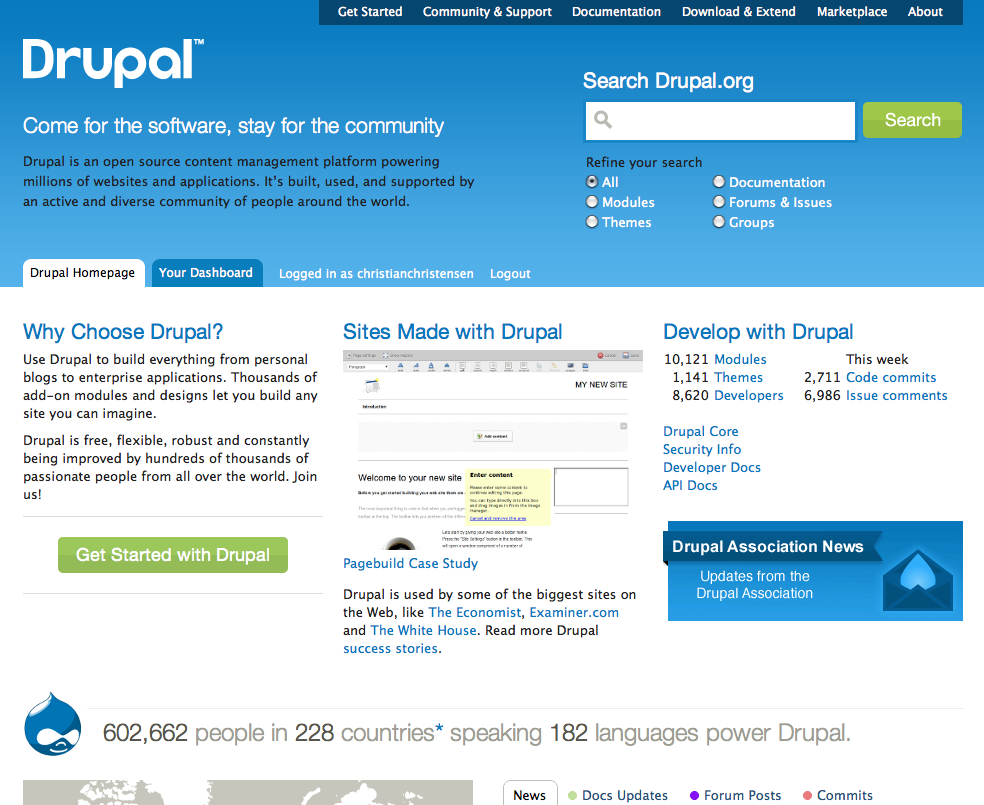
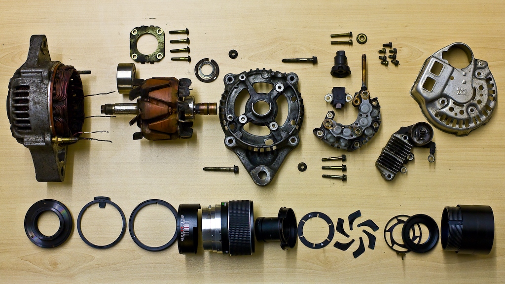

!SLIDE full-page-image title

# Resources #

## Books ##

!SLIDE full-page-image title

# Resources #

## Consulting ##

!SLIDE full-page-image title

# Resources #

## Conferences ##

!SLIDE full-page-image title

# Get started #

## [drupal.org](http://drupal.org) ##

!SLIDE full-page-image

Image courtesy of <a rel="cc:attributionURL" href="http://www.flickr.com/photos/purplemattfish/">purplemattfish</a> <a rel="license" href="http://creativecommons.org/licenses/by-nc-nd/2.0/">(CC)</a>

!SLIDE

# Walkthrough #

### [drupal.org/project/vagrant](http://drupal.org/project/vagrant) ###
### Install ###
### [Drush](http://drupal.org/project/drush) / [Drush make](http://drupal.org/project/drush_make) ###
### [Views](http://drupal.org/project/views) ###
### [Features](http://drupal.org/project/features) ###

