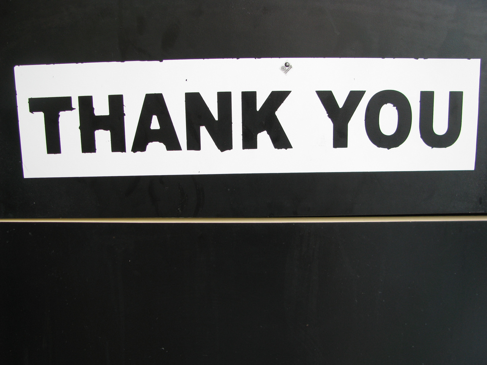

!SLIDE credits

# Links #

Sponsor - <http://allplayers.com>

*  Attribution
   *  [How github uses github](http://zachholman.com/talk/how-github-uses-github-to-build-github)
   *  [Sparta](http://wallpapers-place.com/images/wallpapers/this_is_sparta_hd_widescreen_wallpapers_1440x900.jpeg)

!SLIDE full-page-image

!SLIDE full-page-image

Image courtesy of <a rel="cc:attributionURL" href="http://www.flickr.com/photos/thetruthabout/">TheTruthAbout...</a> <a rel="license" href="http://creativecommons.org/licenses/by-sa/2.0/">(CC)</a>

