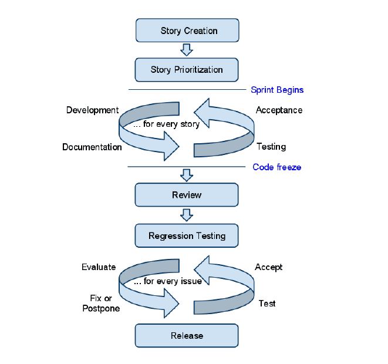
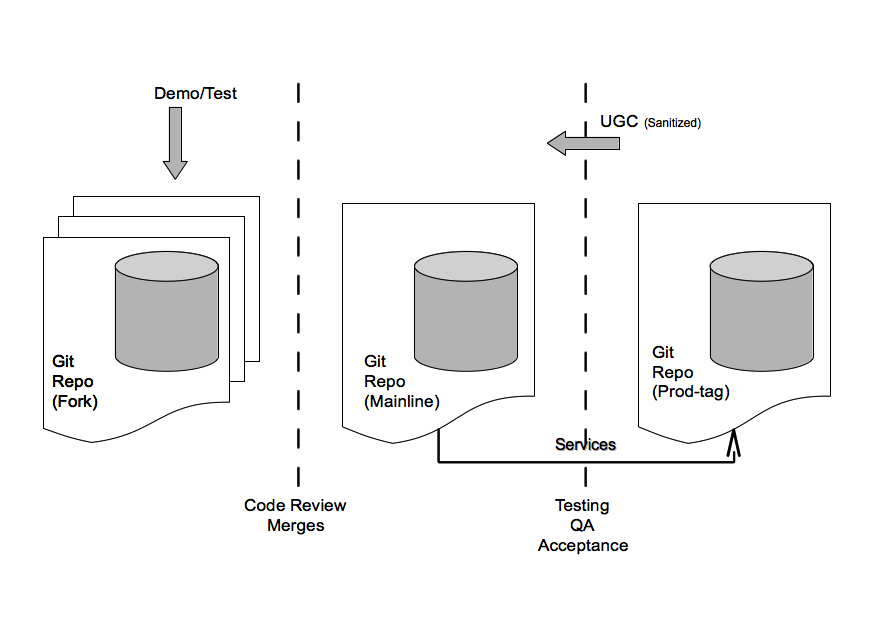
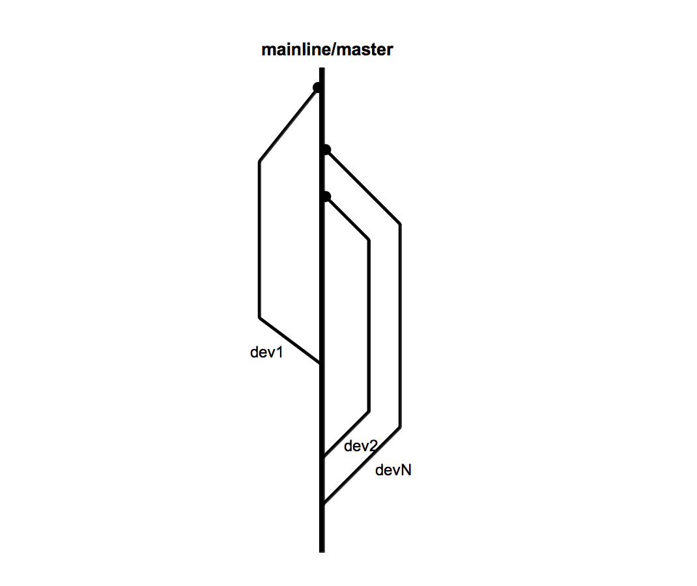
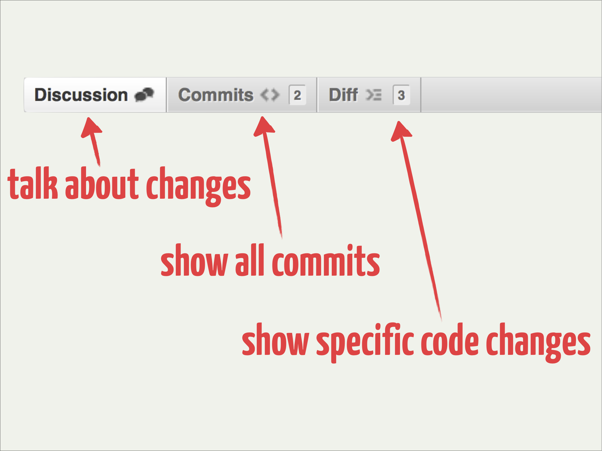
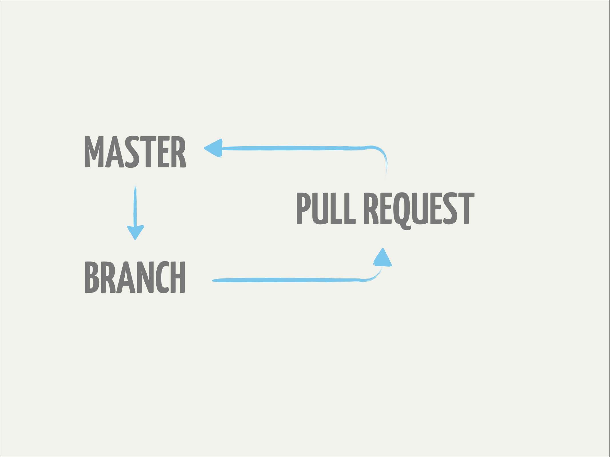
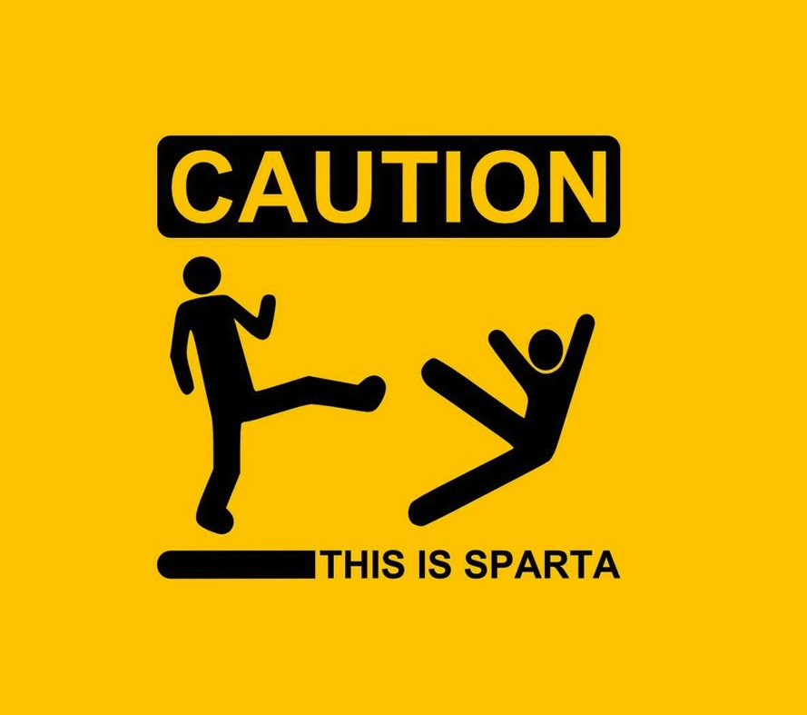

!SLIDE

## Process

*  "Agile development uses feedback to make constant asjustments in a highly collaborative environment."
   *  Andy Hunt (Pragmatic Series)
*  SCRUM (Process!)
*  Branches and pull requests
*  "Gates" - Code-Review AND QA
*  Defense wins games!

!SLIDE

!SLIDE full-page-image title

!SLIDE full-page-image title

!SLIDE full-page-image title

!SLIDE full-page-image title

!SLIDE full-page-image

